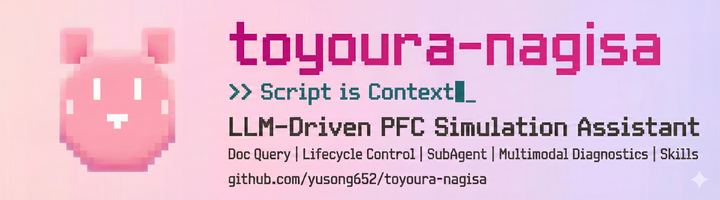

<p align="center">
  
</p>

<p align="center">
  <a href="https://github.com/yusong652/toyoura-nagisa/actions/workflows/test.yml">
    
  </a>
  <a href="https://codecov.io/gh/yusong652/toyoura-nagisa">
    
  </a>
  <a href="https://github.com/yusong652/toyoura-nagisa/blob/main/LICENSE">
    
  </a>
  <a href="https://github.com/yusong652/toyoura-nagisa/pulls">
    
  </a>
</p>

`pfc3d>model new ;but now, Large Language Model.`

**Toyoura Nagisa** demonstrates context engineering for LLM-driven discrete element simulations. It navigates references, writes scripts, runs simulations, and iterates.

`pfc3d>model solve ;llm solves.`

---

## 🎯 Core Features

### 💡 **Persistent Context**

*Script is context. Each execution compounds understanding.*

Every execution is remembered—script, parameters, results. The agent recalls what worked, learns from what failed, and builds upon previous attempts. Context persists across sessions and projects.

### 🔬 **Documentation-Driven Workflow**

*Capability guides action, limitation guides creation.*

Documentation tools guide script generation by providing verified syntax and usage patterns. The agent queries for relevant paths, browses for syntax, and discovers capability boundaries—revealing where to use built-ins and where to innovate.

### ⚡ **Adaptive Simulation Control**

*Autonomy enables iteration.*

The agent manages the simulation lifecycle—submitting, monitoring, analyzing, deciding. Within user-defined goals, it interrupts diverging runs and restarts with adjusted parameters without waiting for step-by-step approval. Continuous progress, faster convergence.

```
Submit → Monitor → Analyze → Decide (continue | interrupt | restart)
```

### 🔍 **Multimodal Diagnostics**

*Qualitative is radar, quantitative is microscope.*

The agent captures visual output during simulation cycles—particle configurations, velocity arrows, contact force chains, cross-sections. Visuals locate anomalies; output data pinpoints the cause.

### 🤖 **SubAgent Delegation**

*Delegate depth, preserve clarity.*

Deep exploration risks context exhaustion and hallucination. SubAgents isolate that complexity—exploring extensively, returning only verified findings.

- **PFC Explorer**: Navigates documentation, returns verified syntax. The MainAgent decides; the Explorer validates.
- **PFC Diagnostic**: Analyzes plots across angles and quantities, returns structured conclusions—not raw images.

### 📚 **Extensible Skills**

*Teach once, reuse forever.*

Skills are structured guides that encode domain expertise. The agent follows them step-by-step, handling complex workflows you'd otherwise explain repeatedly. Don't know how to set up pfc-bridge? The `pfc-bridge-setup` skill walks the agent through environment verification, dependency installation, and bridge launch.

Define your own skills to capture simulation workflows, analysis pipelines, or project-specific conventions. Your expertise becomes reusable agent knowledge.

### 🤝 **Intent Awareness**

*Your scripts are context too.*

- **PFC Console** (`>`): Direct access to PFC's Python environment. Edit scripts, import modules, run experiments. Each execution becomes a tracked task with background support. You stay in control.
- **Terminal** (`!`): Bash commands and outputs flow into agent context automatically.
- **File mentions** (`@`): Reference any file inline; content is injected on the fly.
- **Task status** (`/pfc-list-tasks`): Check running simulations; status details flow into agent context.
- **Mid-execution interaction** (`ESC`, messages): Interrupt the agent or send messages while tools run—context preserved, conversation continues.

The agent sees what you did, no explanation needed.

## 🎨 Additional Features

Beyond the core PFC integration, toyoura-nagisa includes:

- **Multi-Provider LLM Support** - Gemini, Claude, GPT, GLM, Moonshot, OpenRouter, vLLM, Ollama

## 🚀 Quick Start

**Requirements**: Python 3.10+ with [uv](https://github.com/astral-sh/uv), Node.js 18+

```bash
# Clone the repository
git clone https://github.com/yusong652/toyoura-nagisa.git
cd toyoura-nagisa

# Install dependencies
npm install           # Frontend packages (workspaces)
uv sync               # Python backend

# Build all packages (required for first run)
npm run build:all

# Configure
# Backend config is version-controlled (packages/backend/config)
# Add your API keys to .env file

# Start
npm run dev:backend   # Backend API (localhost:8000)
npm run dev:cli       # CLI (or npm run dev:web for Web UI)
```

### PFC Integration

For ITASCA PFC simulations:

1. **Ask Nagisa**: Just say "help me start PFC" and the agent handles environment setup, dependency installation, and server launch.

2. **Manual start**: In PFC GUI IPython console:
   ```python
   %run /path/to/standalone/pfc-mcp/pfc-bridge/start_bridge.py
   ```

Standalone repository: `https://github.com/yusong652/pfc-mcp`

## 🤝 Contributing

1. **Open an issue first** - Discuss your idea before implementing
2. **Fork & PR** - Fork the repo, create a branch, submit PR
3. **Keep PRs focused** - One feature or fix per PR

## 📄 License

This project is licensed under the GNU General Public License v3.0. See the [LICENSE](LICENSE) file for details.
